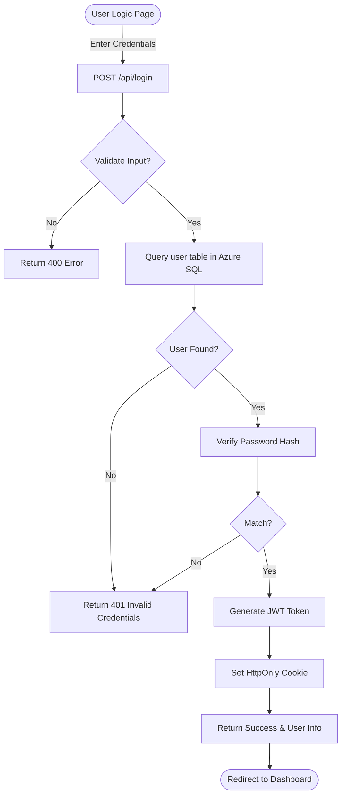

# Application Process Flowcharts

## 1. Authentication Flow (Login)
This flow describes how a user logs into the system using the custom Azure SQL-backed authentication.



## 2. Data Fetching Flow (Org Chart Loading)
This flow shows how the application securely fetches and displays the organization chart, including caching strategies.

```mermaid
flowchart TD
    Page([Org Chart Page]) -->|Load| API[GET /api/orgchart]
    API --> Auth{Middleware: <br/>Has Valid Cookie?}
    Auth -- No --> Login([Redirect to Login])
    Auth -- Yes --> Cache{Check Memory Cache?}
    
    Cache -- Hit --> ReturnCache[Return Cached JSON]
    
    Cache -- Miss --> DB[Connect to Azure SQL]
    DB --> Query[Select * From Employees <br/>Where dept/filter matches]
    Query --> Transform[Transform Logic:<br/>1. Map ID/PID<br/>2. Handle Managers<br/>3. Format Dates]
    
    Transform --> Img[Generate Image URLs <br/>(Point to Supabase Storage)]
    Img --> SaveCache[Save to Memory Cache]
    SaveCache --> ReturnData[Return JSON Response]
    
    ReturnCache --> Render[Render OrgChart.js]
    ReturnData --> Render
```

## 3. Data Modification Flow (Add/Edit Employee)
This flow illustrates the process of modifying data, which involves Azure SQL updates and cache invalidation.

```mermaid
flowchart TD
    User([User Action: Edit/Add]) -->|Payload| Route{API Route}
    
    Route -- POST/PUT --> Guard{Is Authenticated?}
    Guard -- No --> 401[Return 401 Unauthorized]
    
    Guard -- Yes --> Val{Validate Data}
    Val -- Invalid --> 400[Return 400 Bad Request]
    
    Val -- Valid --> SQL[Execute SQL Command <br/>(INSERT / UPDATE)]
    
    SQL --> Success{DB Success?}
    Success -- No --> Err[Log Error & Return 500]
    
    Success -- Yes --> Clear[Invalidate Cache keys: <br/>'employees', 'orgchart']
    Clear --> Resp[Return Success JSON]
    Resp --> UI[UI Updates via SWR Mutation]
```
