# Traffic Flow Analysis

This document details the traffic flow across the entire OrgChart application, visualizing how requests move from the client to the server, database, and external services.

## 1. Global System Traffic Map

This diagram represents the high-level movement of data and requests across the application infrastructure.

```mermaid
graph TD
    %% Nodes
    User(("👤 User / Browser"))
    
    subgraph "Next.js Application Server"
        MW[("🛡️ Middleware<br/>(Edge/Node)")]
        
        subgraph "Client Layer (Frontend)"
            Pages["📄 React Pages<br/>(Next.js App Router)"]
            SWR["🔄 SWR <br/>(Data Fetching)"]
        end
        
        subgraph "API Layer (Backend)"
            LoginAPI["🔑 /api/login"]
            OrgAPI["📊 /api/orgchart"]
            SheetAPI["📝 /api/sheet"]
            ImportAPI["📂 /api/import_excel"]
            UploadAPI["📤 /api/upload-image"]
            
            AuthService["🔐 Auth Service<br/>(JWT Verify)"]
            CacheService["⚡ Memory Cache"]
            Transform["⚙️ Data Transformer"]
        end
    end

    AzureDB[("🛢️ Azure SQL Database<br/>(Primary Data)")]
    Supabase[("☁️ Supabase Storage<br/>(Public Images)")]

    %% Flows
    User -->|HTTPS Request| MW
    
    %% Middleware Routing
    MW -- "No Auth Cookie" --> LoginRedirect["⛔ Redirect /login"]
    MW -- "Valid Cookie" --> Pages
    MW -- "Valid Cookie" --> API_Routes["Pass to API Routes"]
    
    %% Client Side
    Pages -->|User Interaction| SWR
    SWR -->|Async Fetch| API_Routes
    
    %% API Routing
    API_Routes -.-> LoginAPI
    API_Routes -.-> OrgAPI
    API_Routes -.-> SheetAPI
    API_Routes -.-> ImportAPI
    API_Routes -.-> UploadAPI
    
    %% Services Logic
    LoginAPI -->|Verify Creds| AzureDB
    LoginAPI -->|Issue JWT| User
    
    OrgAPI --> AuthService
    OrgAPI -->|Check| CacheService
    
    CacheService -- "Hit" --> OrgAPI
    CacheService -- "Miss" --> QueryDB["🔍 Query Employees"]
    
    QueryDB --> AzureDB
    AzureDB -->|Raw Rows| Transform
    Transform -->|Formatted JSON| CacheService
    
    %% Image Traffic
    Transform -.->|Gen URL| User
    User -.->|Direct Image Fetch| Supabase
    
    %% Write Operations
    SheetAPI -->|Update| AzureDB
    ImportAPI -->|Bulk Insert| AzureDB
    UploadAPI -->|Upload File| Supabase
```

## 2. Detailed Request Sequences

### Scenario A: Full Page Load (Org Chart) & Data Fetching

This flow shows what happens when a user visits the main Org Chart page.

### Scenario B: Authentication (Login)

### Scenario C: Data Modification (Edit Employee)

### Scenario D: Excel Import (Bulk Operation)

### Scenario E: Image Upload (Profile Picture)

## 3. Cache Strategy & Invalidation

The application uses an in-memory cache to reduce database load. Here's how cache invalidation flows work:

```mermaid
flowchart TD
    WriteOp["✏️ Write Operation<br/>(POST/PUT/DELETE)"]
    
    WriteOp --> SheetAPI["/api/sheet"]
    WriteOp --> ImportAPI["/api/import_excel"]
    WriteOp --> OrgChartSave["/api/orgcharts [POST/PUT]"]
    
    SheetAPI --> InvalidateEmp["Invalidate 'employees*'"]
    SheetAPI --> InvalidateOrg["Invalidate 'orgchart*'"]
    
    ImportAPI --> InvalidateEmp
    ImportAPI --> InvalidateOrg
    
    OrgChartSave --> InvalidateCustom["Invalidate 'custom_orgchart_{id}'"]
    
    InvalidateEmp --> NextRead["📖 Next GET Request"]
    InvalidateOrg --> NextRead
    InvalidateCustom --> NextRead
    
    NextRead --> CacheMiss["❌ Cache MISS"]
    CacheMiss --> FreshQuery["🔄 Fresh DB Query"]
    FreshQuery --> Populate["✅ Populate Cache"]
    Populate --> Return["Return Fresh Data"]
```

## 4. Error Handling Paths

### Database Connection Failure

```mermaid
flowchart LR
    Request["API Request"] --> GetConn["getDbConnection()"]
    GetConn --> CheckPool["Pool Connected?"]
    
    CheckPool -- Yes --> UsePool["Return Existing Pool"]
    CheckPool -- No --> Reconnect["Attempt Reconnect"]
    
    Reconnect --> Success["✅ Connected"]
    Reconnect --> Failure["❌ Connection Failed"]
    
    Failure --> LogError["Log Error + Config"]
    LogError --> Throw["Throw Error"]
    Throw --> APIError["500 Internal Server Error"]
    
    Success --> UsePool
    UsePool --> Proceed["Continue Request"]
```

### Authentication Failure

```mermaid
flowchart TD
    Request["Incoming API Request"] --> Middleware["Middleware Check"]
    
    Middleware --> HasCookie{"Has 'auth' Cookie?"}
    HasCookie -- No --> RedirectLogin["↩️ Redirect to /login"]
    HasCookie -- Yes --> APIRoute["Route to API"]
    
    APIRoute --> Verify["isAuthenticated()"]
    Verify --> Decrypt["decrypt(JWT)"]
    
    Decrypt --> Valid{"Valid Token?"}
    Valid -- No --> Return401["❌ 401 Unauthorized"]
    Valid -- Yes --> ProcessRequest["✅ Process Request"]
```

## 5. Key Data Transformation Points

### Flat to Hierarchical (OrgChart)

The `/api/orgchart` endpoint performs complex data transformation:

```mermaid
flowchart TD
    Raw["📊 Raw SQL Rows<br/>(employees table)"] --> Parse["Parse Each Employee"]
    
    Parse --> ExtractManager["Extract line_manager<br/>(format: 'ID: Name')"]
    ExtractManager --> TrimZeros["Trim Leading Zeros"]
    
    TrimZeros --> CheckIndirect{"is_direct = 'NO'?"}
    
    CheckIndirect -- Yes --> IndirectNode["Create as Indirect<br/>managerId = 'i-{id}'"]
    CheckIndirect -- No --> DirectNode["Create as Direct<br/>managerId = {id}"]
    
    IndirectNode --> CreateDept["Create Department Node"]
    DirectNode --> CreateDept
    
    CreateDept --> AssignParent["Assign Parent<br/>(pid = managerId or Dept)"]
    
    AssignParent --> FormatDates["Format Dates<br/>(Excel Serial → DD/MM/YYYY)"]
    FormatDates --> GenImageURL["Generate Image URLs<br/>(Supabase Storage)"]
    
    GenImageURL --> AddTags["Add Tags<br/>(probation, headcount, etc)"]
    AddTags --> Output["🌲 Hierarchical JSON<br/>(OrgChart.js compatible)"]
```

## 6. Admin Approval Workflow

For line manager change requests:

## 7. Technology Stack Summary

| Layer | Technology | Purpose |
|-------|-----------|---------|
| **Frontend** | Next.js 14+ (App Router) | SSR, Routing, React Components |
| **State Management** | SWR | Data fetching, caching, revalidation |
| **Styling** | Tailwind CSS | Utility-first styling |
| **API Layer** | Next.js API Routes | Serverless backend functions |
| **Database** | Azure SQL Database | Primary data storage (employees, users, departments) |
| **ORM/Client** | `mssql` (node-mssql) | Direct SQL queries to Azure SQL |
| **Authentication** | Custom JWT + HttpOnly Cookies | Session management |
| **Storage** | Supabase Storage | Public image/avatar hosting |
| **Visualization** | OrgChart.js | Interactive org chart rendering |
| **Excel Processing** | `xlsx` library | Import/export employee data |
| **Cache** | In-memory Map | App-level caching (15min TTL) |

---

**Document Version**: 1.0  
**Last Updated**: 2026-02-11  
**Author**: System Analysis
